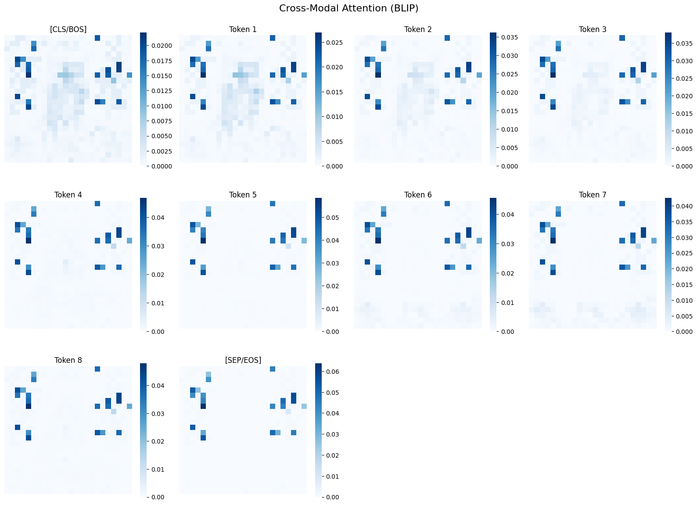

# 🔍 Transformers Attention Viz

Interactive attention visualization for multi-modal transformer models

[](https://badge.fury.io/py/transformers-attention-viz)
[](https://www.python.org/downloads/)
[](LICENSE)
[](https://github.com/huggingface/transformers)

**Visualize and understand cross-modal attention in vision-language models like BLIP and CLIP**

## 🚀 Try it Now!

[](https://colab.research.google.com/github/sisird864/transformers-attention-viz/blob/master/demo.ipynb) **Full Demo** - Explore all features

## 🎯 Features

- 📊 **Cross-Modal Attention**: Visualize how text tokens attend to image regions in BLIP
- 🔄 **Multi-Layer Support**: Analyze attention patterns across all transformer layers
- 📈 **Attention Statistics**: Compute entropy, concentration, and top attended regions
- 🎨 **Publication Ready**: Export high-quality figures for papers (PNG, PDF, SVG)
- 🚀 **Easy Integration**: Works seamlessly with HuggingFace models
- 🖥️ **Interactive Dashboard**: Explore attention patterns in real-time (local only)

## 📦 Installation

```bash
pip install transformers-attention-viz
```

## 💡 Basic Usage

```python
from transformers_attention_viz import AttentionVisualizer
from transformers import BlipProcessor, BlipForConditionalGeneration
from PIL import Image

# Load BLIP model (supports cross-modal attention)
model = BlipForConditionalGeneration.from_pretrained("Salesforce/blip-image-captioning-base")
processor = BlipProcessor.from_pretrained("Salesforce/blip-image-captioning-base")

# Create visualizer
visualizer = AttentionVisualizer(model, processor)

# Load your image
image = Image.open("cat.jpg")
text = "a fluffy orange cat"

# Visualize cross-modal attention
viz = visualizer.visualize(
    image=image,
    text=text,
    visualization_type="heatmap",
    attention_type="cross"  # text -> image attention
)
viz.show()

# Get attention statistics
stats = visualizer.get_attention_stats(image, text, attention_type="cross")
print(f"Average entropy: {stats['entropy'].mean():.3f}")
print(f"Top attended regions: {stats['top_tokens'][:3]}")
```

## 📸 Example Visualizations

### Cross-Modal Attention (BLIP)
Each text token gets its own heatmap showing attention to image patches:

```python
# Visualizing "a fluffy orange cat sitting on a surface"
# Generates separate heatmaps for each token
```


### Attention Statistics
```python
# Example output:
Average entropy: 4.251
Top attended regions: 
  1. Patch_(24,4): 0.0429
  2. Patch_(20,1): 0.0395
  3. Patch_(23,4): 0.0391
```

## 🛠️ Advanced Features

### Multi-Layer Analysis
```python
# Visualize attention at different layers
viz = visualizer.visualize(
    image=image,
    text=text,
    layer_indices=[0, 5, 11],  # First, middle, last
    attention_type="cross"
)
```

### Export for Publications
```python
# Save high-quality figures
viz.save("attention_figure.png", dpi=300)  # For papers
viz.save("attention_figure.pdf")           # For LaTeX
viz.save("attention_figure.svg")           # For web
```

### Interactive Dashboard
```python
from transformers_attention_viz import launch_dashboard

# Launch interactive exploration tool (requires local environment)
launch_dashboard(model, processor)
# Opens at http://localhost:7860
```

## 🤖 Supported Models

| Model | Cross-Modal Attention | Self-Attention | Status |
|-------|---------------------|----------------|---------|
| BLIP | ✅ | ✅ | Fully Supported |
| CLIP | ❌ | ✅ | Self-Attention Only |
| BLIP-2 | ✅ | ✅ | Coming Soon |
| Flamingo | ✅ | ✅ | In Development |

## 📊 Understanding the Visualizations

- **BLIP Cross-Modal Attention**: Shows how each text token attends to the 24×24 grid of image patches
- **Attention Entropy**: Lower entropy indicates more focused attention
- **Diffuse Attention**: BLIP often shows uniform attention, especially on simple images - this is normal behavior

## 🤝 Contributing

We welcome contributions! Please see our [Contributing Guide](CONTRIBUTING.md) for details.

```bash
# Clone the repo
git clone https://github.com/sisird864/transformers-attention-viz.git
cd transformers-attention-viz

# Install in development mode
pip install -e ".[dev]"

# Run tests
pytest tests/
```

## 📖 Citation

If you use this tool in your research, please cite:

```bibtex
@software{transformers-attention-viz,
  author = {Sisir Doppalapudi},
  title = {Transformers Attention Viz: Interactive Attention Visualization for Multi-Modal Transformers},
  year = {2024},
  publisher = {GitHub},
  url = {https://github.com/sisird864/transformers-attention-viz}
}
```

## 🚧 Known Limitations

- **v0.1.15**:
  - Individual attention head visualization (aggregate_heads=False) not fully supported
  - Flow visualization has dimension compatibility issues with BLIP
  - BLIP text self-attention not captured (cross-modal and vision self-attention work fine)

## 🛤️ Roadmap

- [ ] Full support for individual attention heads
- [ ] Fix flow visualization for BLIP
- [ ] Add BLIP-2 support
- [ ] Add LLaVA support
- [ ] 3D attention visualization
- [ ] Attention pattern export to TensorBoard
- [ ] Real-time video attention tracking

## 📄 License

MIT License - see [LICENSE](LICENSE) for details.

## 🙏 Acknowledgments

- HuggingFace team for the amazing Transformers library
- Salesforce Research for BLIP
- OpenAI for CLIP
- All contributors and users of this tool

## ⭐ Support

If you find this tool useful, please consider:
- Starring this repository
- Sharing it with colleagues
- Contributing improvements
- Citing it in your research

---

Made with ❤️ for the ML research community